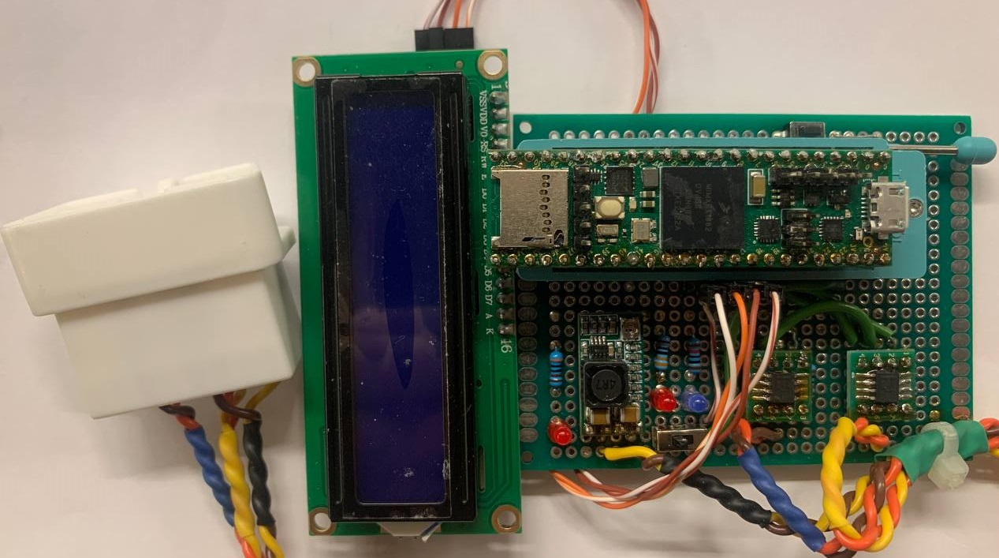

# Volvo CEM pin cracker via OBD
This is a fork of original Volvo CEM pin cracker via OBD https://github.com/vtl/volvo-cem-cracker

Please visit the link above to view details of the original project.

## The difference
This implementation has some minor features, which could be useful to someone:
1. 'Abort' button to exit from cracking process with ECUs exiting from programming mode. Pressing the 'Abort' button on the brute-force stage leads to displaying the last tried brute-force value.
2. Allows to run brute-forcing starting any value.
3. i2c LCD support. Allows you to disconnect the cracker from the PC and see the progress and result on the LCD. LCD displays current stage on the top line while the progress in scope of current stage, intermediate and final results are displayed on the bottom line.

LCD support in current implementation does not assume fully autonomous operation without connection to PC. Viewing the operation log on PC is still an important part required for understanding what the hell is going on. But in many cases for example long brute-forcing of 4 remaining bytes LCD is useful not to keep a PC in the car.

Circuit diagram is shown below.

Let's look at this implementation as a managed solution, the required tuning can be done by variables' values changing at the top of source-code. All descriptions below assume that the HW part is OK.

## Possible issues and fixes
Depending on your CEM model, you may face some issues with PIN decoding. Here are some examples and recommendations.

#### Unable to decode 3rd byte

Cracker decodes the first 2 bytes, but the third byte is always different so PIN cannot be decoded. For example:
```
Attempt 1:
21:54:30.212 -> Candidate PIN 32 78 79 -- -- -- : brute forcing bytes 3 to 5 (3 bytes), will take up to 646 seconds
...
Attempt 2:
22:30:45.288 -> Candidate PIN 32 78 78 -- -- -- : brute forcing bytes 3 to 5 (3 bytes), will take up to 646 seconds

Attempt 3:
23:06:12.024 -> Candidate PIN 32 78 02 -- -- -- : brute forcing bytes 3 to 5 (3 bytes), will take up to 646 seconds

Attempt 4:
14:26:13.327 -> Candidate PIN 32 78 41 -- -- -- : brute forcing bytes 3 to 5 (3 bytes), will take up to 646 seconds
```

There are possible solutions that may help:

1. Use brute-force for the rest of bytes - it may take up to 18-20 hours. To do it, change the following tunable parameter value to 2 in line #16:
```
#define CALC_BYTES   2      /* how many PIN bytes to calculate (1 to 4), the rest is brute-forced. Default value is 3 */
```
2. And to avoid time waste, indicate the number of known bytes and hardcode the first bytes that you already know in lines #17 and #18:
```
#define KNOWN_BYTES  2      /* how many PIN bytes we know and skip it from calculation. Default value is 0 */
int kpin[6] = { 0x32, 0x78, 0x00, 0x00, 0x00, 0x00 };    /* replace 0x00 by values for known PIN bytes. Default values are 0x00 */
```
3. Another solution that may help - change the value from 'true' to 'false' in the line #15:
```
#define CPU_CLOCK    false   /* true - to limit CPU by 180 MHz, false - to unlimit CPU frequency. Default value is true */
```
4. To run brute-force starting non 0 number (for example if you stopped brute-force by 'Abort' button at any point and you want to continue brute-forcing from the same point) you have to setup the required number as value of 'initValue' variable:
```
uint32_t initValue = 0;    /* the initial value for brute-force search. Default value is 0 */
```
It can be especially useful in the case of 4 bytes brute-forcing, which could take up to 18 hours, this way brute-forcing can be splitted to parts.

## Other hints
1. If you would like to hide displaying information on LCD change the value to 'false'
```
#define LCD           true   /* true - to print out info on 1602 LCD connected via i2c. Default value is true */
```
2. You can use the 'Abort' button to stop the cracking process and force ECUs to exit from programming mode. Either after exit from the cracking process the pressing on 'Abort' button sends commands to ECUs to exit from programming mode. 

## Ideas for enthusiasts :)
1. Add a 'Continue' button or switch and logic to write calculated bytes and last tried brute-force value into EEPROM in case of pressing on 'Abort' button. So running the cracker next time with the pressed button 'Continue' will force the cracker to read saved data from EEPROM and continue the cracking process with minimal time loss and without losing time of repetition of already passed steps.
2. Add a 'Calc_Bytes' button or switch to set the value (2 or 3) of CALC_BYTES. It is already done in the original project by Mark. That way the solution will become quite autonomous.

## Pictures

### Circuit diagram

### HW implementation

### LCD screenshots

